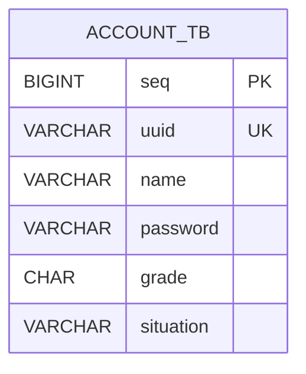

# 05. ERD 명세서 - 인증/사용자 (Auth)

문서 버전: 1.0.0 | 생성일: 2026-01-12

---

## 1. 테이블: account_tb

| 컬럼명 | 타입 | 제약조건 | 설명 |
|--------|------|----------|------|
| seq | BIGINT | PK, AUTO_INCREMENT | 시퀀스 |
| uuid | VARCHAR(50) | NOT NULL, UNIQUE | 로그인 ID |
| name | VARCHAR(50) | NOT NULL | 사용자명 |
| password | VARCHAR(255) | NOT NULL | BCrypt 암호화 비밀번호 |
| grade | CHAR(1) | NOT NULL, DEFAULT 'N' | 등급 (A:관리자, N:일반) |
| situation | VARCHAR(20) | NULL | 상태 |

---

## 2. 인덱스

- **PK**: seq
- **UNIQUE**: uuid

---

## 3. 등급 코드

| 코드 | 설명 |
|------|------|
| A | 관리자 (Admin) |
| N | 일반 (Normal) |

---

## 4. ERD 다이어그램

