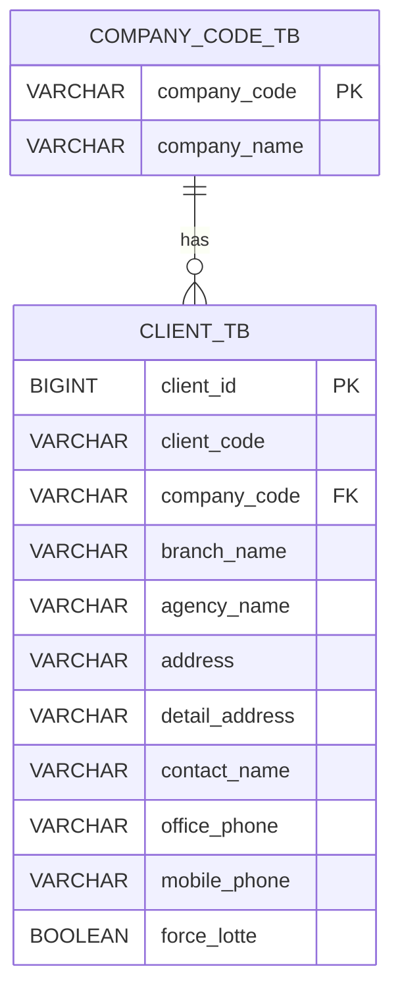

# 05. ERD 명세서 - 거래처 관리 (Client)

문서 버전: 1.0.0 | 생성일: 2026-01-12

---

## 1. 주요 테이블

### client_tb (거래처 마스터)

| 컬럼명 | 타입 | 설명 |
|--------|------|------|
| client_id | BIGINT | PK |
| company_code | VARCHAR | 회사 코드 |
| branch_name | VARCHAR | 지점명 |
| agency_name | VARCHAR | 대리점명 |
| address | VARCHAR | 주소 |
| detail_address | VARCHAR | 상세주소 |
| contact_name | VARCHAR | 담당자명 |
| office_phone | VARCHAR | 사무실 전화 |
| mobile_phone | VARCHAR | 휴대폰 |
| force_lotte | BOOLEAN | 롯데택배 강제 여부 |

---

## 2. ERD 다이어그램

