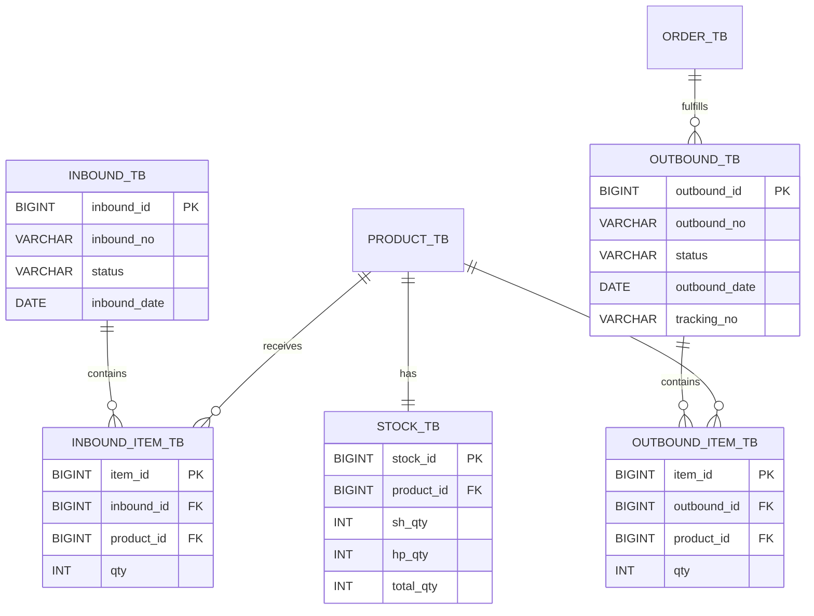

# 05. ERD 명세서 - 입출고 관리 (InOut)

문서 버전: 1.0.0 | 생성일: 2026-01-12

---

## 1. 주요 테이블

### inbound_tb (입고 마스터)

| 컬럼명 | 타입 | 설명 |
|--------|------|------|
| inbound_id | BIGINT | PK |
| inbound_no | VARCHAR | 입고번호 |
| status | VARCHAR | 상태 |

### inbound_item_tb (입고 상세)

| 컬럼명 | 타입 | 설명 |
|--------|------|------|
| item_id | BIGINT | PK |
| inbound_id | BIGINT | FK → inbound_tb |
| product_id | BIGINT | FK → product_tb |
| qty | INT | 수량 |

### outbound_tb (출고 마스터)

| 컬럼명 | 타입 | 설명 |
|--------|------|------|
| outbound_id | BIGINT | PK |
| outbound_no | VARCHAR | 출고번호 |
| status | VARCHAR | 상태 |

### outbound_item_tb (출고 상세)

| 컬럼명 | 타입 | 설명 |
|--------|------|------|
| item_id | BIGINT | PK |
| outbound_id | BIGINT | FK → outbound_tb |
| product_id | BIGINT | FK → product_tb |
| qty | INT | 수량 |

### stock_tb (재고)

| 컬럼명 | 타입 | 설명 |
|--------|------|------|
| stock_id | BIGINT | PK |
| product_id | BIGINT | FK → product_tb |
| sh_qty | INT | SH 창고 수량 |
| hp_qty | INT | HP 창고 수량 |

---

## 2. ERD 다이어그램

