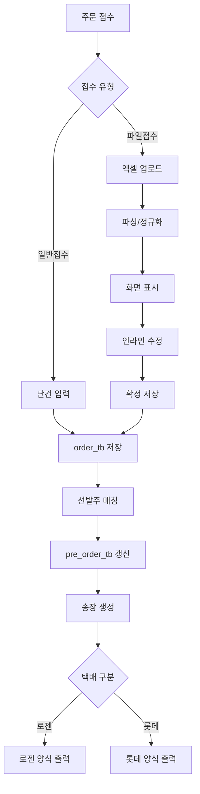

# 01. 시스템 구상도 - 주문 관리 (Order)

문서 버전: 1.1.0 | 생성일: 2026-01-21

---

## 목적

- 주문(Order) 모듈의 전체 기능 범위와 주요 처리 흐름(일반접수/파일접수/매칭/송장)을 한 장에서 이해할 수 있도록 정리합니다.

---

## 범위 (In / Out)

- **In**: 주문 조회, 일반접수, 파일접수, 자동 매칭, 송장 생성
- **Out**: 결제/정산, 택배사 API 실시간 연동

---

## 용어(정의)

| 용어 | 설명 |
|------|------|
| 일반접수 | 화면에서 주문 단건 입력 |
| 파일접수 | 엑셀 업로드 기반 대량 주문 |
| 선발주 | 사전 등록된 주문 |
| 자동 매칭 | 선발주와 파일주문을 기준키로 매칭 |

---

## 전체 흐름(그림)

---

## 주요 규칙 요약

- 매칭 기준: **대리점명 + 제품명**
- 수량 케이스: 완전일치 / 덜 주문(잔량 이월) / 더 주문(추가 출고)
- 택배구분: 메모에 CJ/롯데 → 롯데, 그 외 → 로젠

---

## 예외/에러 케이스

- 엑셀 필수 컬럼 누락 또는 형식 오류
- 제품명/대리점명 표기 차이로 매칭 실패
- 송장 포맷 선택 오류(택배사 구분 실패)

---

## 관련 화면/테이블/코드 링크

- 화면: /order, /order/register, /order/upload, /order/invoice
- 테이블: order_tb, order_item_tb, pre_order_tb, courier_fare_tb
- 코드: OrderController, OrderService, Excel parsing(POI)
