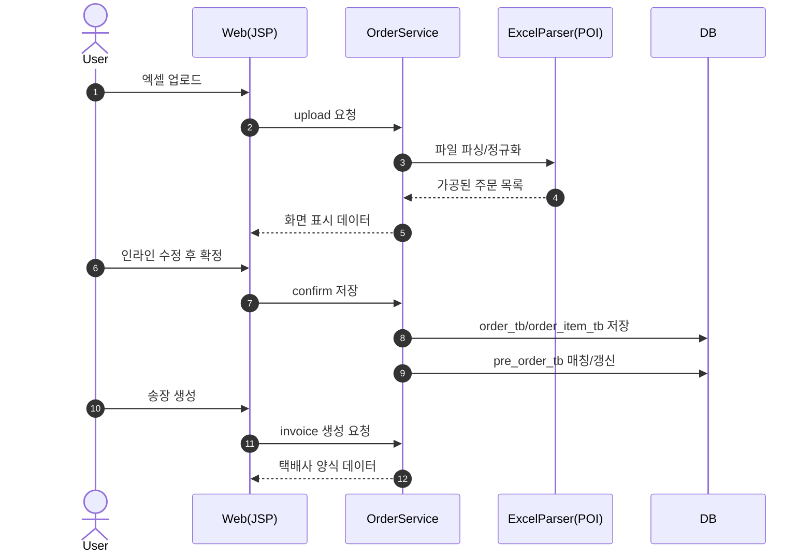

# 03. 기능 명세서 - 주문 관리 (Order)

문서 버전: 1.1.0 | 생성일: 2026-01-21

---

## 목적

- 주문(Order) 모듈 기능(FN)을 화면/엔드포인트 기준으로 정리하고, 입력/처리/출력을 명확히 합니다.

---

## 범위 (In / Out)

- **In**: 주문 조회, 일반접수, 파일접수, 자동 매칭, 송장 생성
- **Out**: 결제/정산

---

## 용어(정의)

- **FN-ORD-\***: 주문 모듈 기능 ID

---

## 기능 목록

### 1. FN-ORD-001 주문 목록 조회

- 경로: GET /order
- 입력: 날짜, 거래처, 제품, 상태 필터
- 처리: 조건 검색 + 페이징
- 출력: 주문 목록

### 2. FN-ORD-002 일반접수(단건 등록)

- 경로: POST /order/register
- 입력: 거래처, 제품, 수량, 주소, 메모
- 처리: order_tb INSERT
- 출력: 등록 결과

### 3. FN-ORD-003 파일접수(엑셀 업로드)

- 경로: POST /order/upload
- 입력: 엑셀 파일
- 처리: POI 파싱 → 정규화 → 화면 표시 → 확정 저장
- 출력: 파싱 결과 / 저장 결과

### 4. FN-ORD-004 선발주 자동 매칭

- 경로: 파일접수 확정 시 자동 실행
- 입력: 파일접수 주문 목록
- 처리: 대리점명+제품명 기준 매칭, 수량 차감
- 출력: 매칭 결과, pre_order_tb 갱신

### 5. FN-ORD-005 송장 생성

- 경로: GET /order/invoice
- 입력: 주문 ID 목록
- 처리: 택배사 구분 → 양식 생성
- 출력: 로젠/롯데 양식 데이터

---

## 기능 연계(그림)

---

## 예외/에러 케이스

- 업로드 실패: 파일 손상/형식 오류/용량 초과
- 확정 저장 실패: 필수값 누락, 참조 데이터 불일치

---

## 관련 화면/테이블/코드 링크

- 화면: /order, /order/register, /order/upload, /order/invoice
- 테이블: order_tb, order_item_tb, pre_order_tb, courier_fare_tb
- 코드: OrderController, OrderService, ExcelParser
