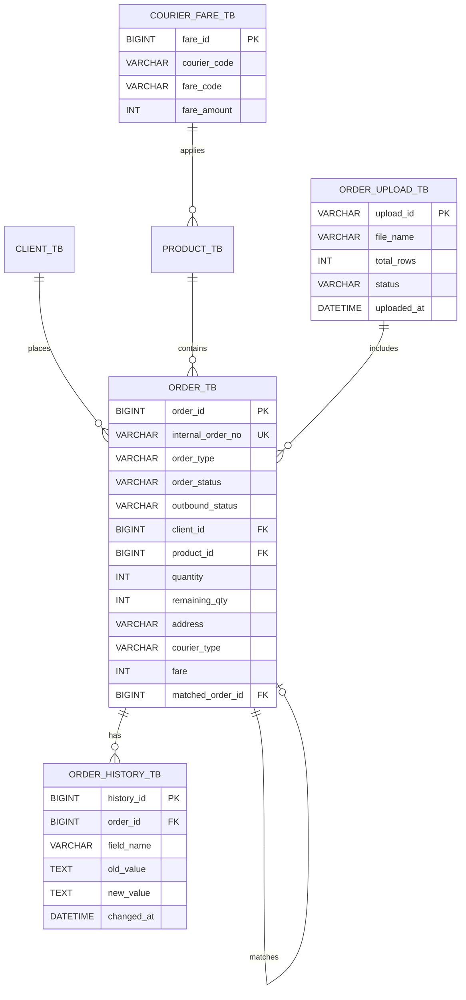

# 05. ERD 명세서 - 주문 관리 (Order)

문서 버전: 1.1.0 | 생성일: 2026-01-21

---

## 목적

- 주문(Order) 도메인에서 사용하는 테이블 구조와 관계를 정리합니다.

---

## 범위 (In / Out)

- **In**: order_tb, order_item_tb, pre_order_tb, courier_fare_tb
- **Out**: 결제/정산, 배송지 분리 테이블

---

## 용어(정의)

| 용어 | 설명 |
|------|------|
| order_tb | 주문 마스터 |
| order_item_tb | 주문 상세(라인) |
| pre_order_tb | 선발주/잔량 관리 |
| courier_fare_tb | 택배비 기준 |

---

## ERD 다이어그램

---

## 예외/에러 케이스

- order_item_tb 저장 시 order_id 미존재 → FK 오류
- 중복 송장 출력 방지를 위한 status 전이 규칙 필요

---

## 관련 화면/테이블/코드 링크

- 화면: 주문 목록/등록/파일접수/송장
- 코드: 주문 저장 트랜잭션, 매칭 로직(pre_order_tb 갱신)
