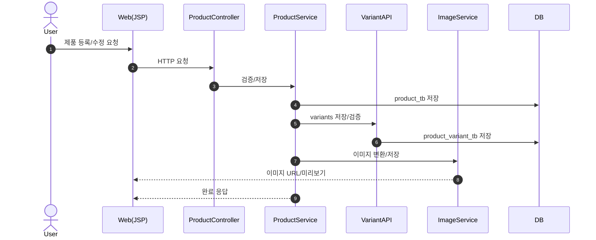

# 03. 기능 명세서 - 제품 관리 (Product)

문서 버전: 1.1.0 | 생성일: 2026-01-12

---

## 목적

- 제품(Product) 모듈 기능(FN)을 화면/엔드포인트 기준으로 정리하고 입력/처리/출력을 명확히 합니다.

---

## 범위 (In / Out)

- **In**: 목록/등록/상세/수정, 변형 API, 이미지 처리
- **Out**: 외부 상품 연동

---

## 용어(정의)

- **FN-PRD-\***: 제품 모듈 기능 ID

---

## 기능 목록

### 1. FN-PRD-001 제품 목록 조회

- 경로: GET /inventory
- 입력: 유형, 카테고리, 검색어
- 처리: 조건 검색 + 재고 상태 계산
- 출력: 제품 목록 + 재고 상태

### 2. FN-PRD-002 제품 등록

- 경로: POST /product/register
- 입력: 코드 조합, 제품 정보, 변형, 이미지
- 처리: 코드 검증 → product_tb INSERT → variants 저장 → 이미지 변환
- 출력: 등록 결과

### 3. FN-PRD-003 제품 상세 조회

- 경로: GET /product/detail/{id}
- 입력: product_id
- 처리: 제품 + 변형 + 이미지 조회
- 출력: 상세 정보

### 4. FN-PRD-004 제품 수정

- 경로: PUT /product/{id}
- 입력: 수정 데이터, 수정 사유
- 처리: 검증 → UPDATE → 이력 기록
- 출력: 수정 결과

### 5. FN-PRD-005 제품 변형 관리(API)

- 경로: GET/POST /api/product/{id}/variants
- 입력: 변형 데이터
- 처리: 합계 검증 → 저장
- 출력: 변형 목록

### 6. FN-PRD-006 이미지 관리

- 경로: POST /api/product/{id}/image
- 입력: 이미지 파일
- 처리: WebP 변환 → 저장
- 출력: 이미지 URL

---

## 기능 연계(그림)

---

## 예외/에러 케이스

- 코드/필수값 검증 실패
- 변형 합계 검증 실패
- 이미지 변환 실패

---

## 관련 화면/테이블/코드 링크

- 화면: /inventory, /product/register, /product/detail/...
- 테이블: product_tb, product_variant_tb
- 코드: ProductController, ProductService, Variant API
