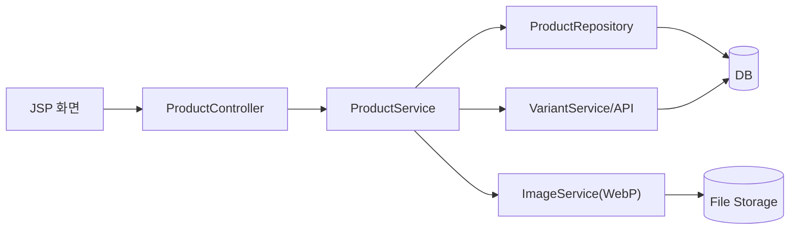
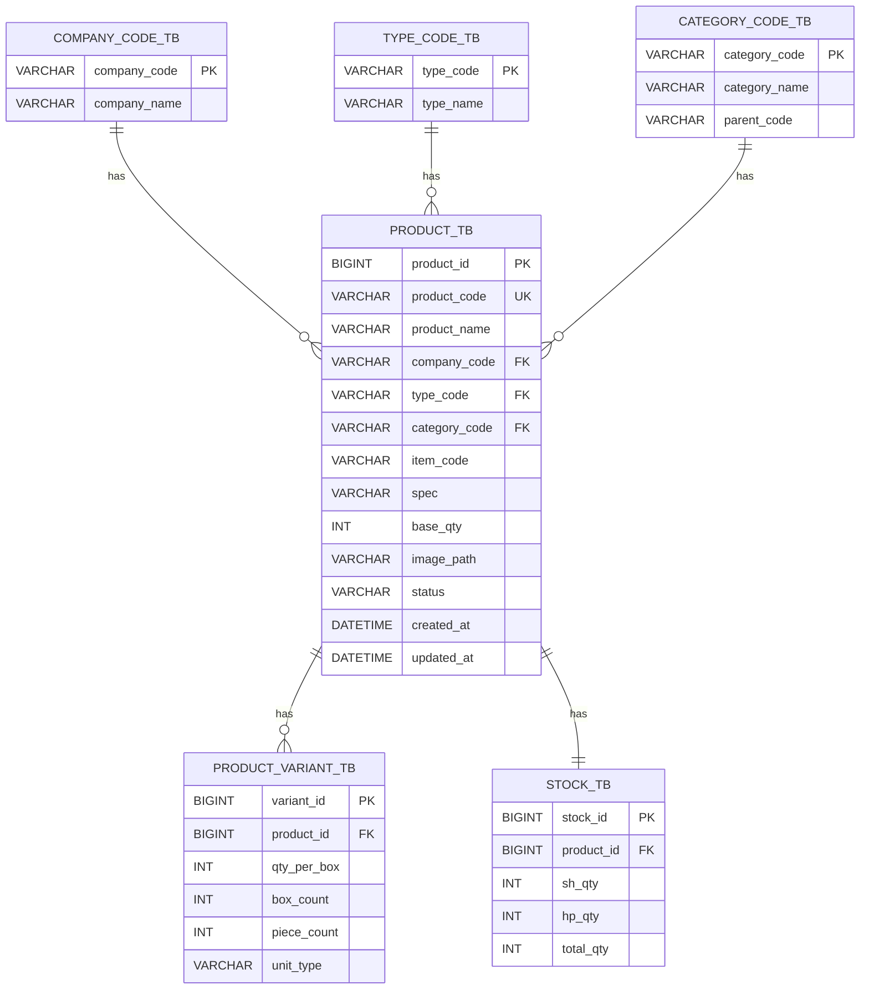

# 05. ERD 명세서 - 제품 관리 (Product)

문서 버전: 1.1.0 | 생성일: 2026-01-12

---

## 목적

- 제품(Product) 모듈의 구성요소와 핵심 기능(코드체계/변형/이미지/재고표시)을 한 장으로 이해할 수 있도록 정리합니다.

---

## 범위 (In / Out)

- **In**: 제품 CRUD, 코드 체계, 변형 관리, 이미지(WebP), 재고 상태 표시
- **Out**: 외부 상품 연동

---

## 용어(정의)

| 용어 | 설명 |
|------|------|
| 제품 코드 | 회사/유형/카테고리/아이템 코드 조합 |
| Variant(변형) | 입수량 기준 파생 단위 |

---

## 모듈 구성

- 제품 마스터 관리: 등록/목록/상세/수정/비활성화
- 코드 관리: 회사/유형/카테고리 코드 CRUD
- 변형 관리: 입수량별 BOX/낱개 수량, 합계 검증
- 이미지 관리: 업로드 → WebP 변환 → 저장/조회
- 이력 관리: 정보 변경 이력, 재고 변경 이력

---

## 전체 흐름(그림)

---

## ERD 다이어그램

---

## 예외/에러 케이스

- 코드 조합 실패/중복
- 변형 합계 검증 실패
- 이미지 변환 실패

---

## 관련 화면/테이블/코드 링크

- 화면: /inventory, /product/register, /product/detail/...
- 테이블: product_tb, product_variant_tb
- 코드: ProductController, ProductService, Variant API
